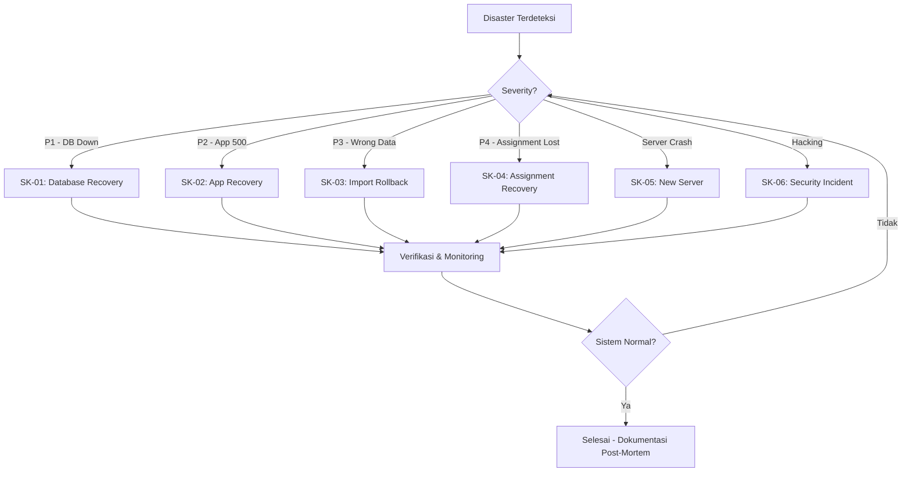

# Disaster Recovery Plan — Dashboard SE2026 Jember

## 1. Tujuan

Dokumen ini menjelaskan langkah-langkah pemulihan untuk skenario kegagalan/emergency pada sistem Dashboard SE2026. Setiap skenario memiliki prioritas, RTO (Recovery Time Objective), dan prosedur langkah-demi-langkah.

## 2. Tingkat Prioritas & Kontak

| Prioritas | Sistem | RTO Maks | RPO | PIC |
|-----------|--------|----------|-----|-----|
| **P1** | Database dashboard tidak bisa diakses | 2 jam | 6 jam | Admin BPS |
| **P2** | Aplikasi web error/500 | 4 jam | 24 jam | Admin BPS |
| **P3** | Data import salah/tercemar | 8 jam | 30 hari | Operator |
| **P4** | Kehilangan data assignment | 24 jam | 6 jam | Admin BPS |

## 3. Skenario Disaster

### SK-01: Database Corrupt / Tidak Bisa Diakses

**Gejala**: Halaman dashboard error "Database connection failed", semua query gagal.

**RTO**: 2 jam

**Langkah**:

1. **Diagnosis (5 menit)**
   ```bash
   # Cek koneksi database
   mysql -u root -e "SELECT 1"
   # Cek service MySQL
   net start | findstr MySQL
   ```

2. **Restart Service (5 menit)**
   ```powershell
   # Laragon: restart via tray icon
   # Atau command line:
   net stop "laragon_mysql"
   net start "laragon_mysql"
   ```

3. **Cek Integritas Database (10 menit)**
   ```bash
   mysqlcheck -u root -o bps_jember_se2026
   mysqlcheck -u root --repair bps_jember_se2026 sipw_import sipw_assignment
   ```

4. **Restore dari Backup Terakhir (30 menit)**
   ```powershell
   cd scripts
   # Lihat backup terakhir
   .\restore.ps1 -List
   # Restore
   .\restore.ps1 -File "storage\backups\dashboard_full_20260527_020000.sql.gz" -Force
   ```

5. **Verifikasi (5 menit)**
   ```bash
   mysql -u root -e "
     USE bps_jember_se2026;
     SELECT 'DB_OK' AS status;
     SELECT COUNT(*) AS total_sls FROM sipw_import;
     SELECT COUNT(*) AS total_asg FROM sipw_assignment;
   "
   ```

**Rollback Plan**: Jika restore gagal, safety backup `pre_restore_*.sql.gz` bisa dikembalikan.

---

### SK-02: Aplikasi Error 500 / White Screen

**Gejala**: Halaman dashboard menampilkan error 500, white screen, atau PHP fatal error.

**RTO**: 4 jam

**Langkah**:

1. **Cek Error Log (5 menit)**
   ```bash
   # Cek PHP error log
   tail -100 storage/logs/php_error.log
   # Cek Apache/Nginx error log
   Get-Content "C:\laragon\logs\php_error_log.txt" -Tail 50
   ```

2. **Cek Mode Debug (5 menit)**
   ```bash
   # Aktifkan debug sementara di .env
   APP_DEBUG=true
   # Refresh browser untuk melihat pesan error detail
   ```

3. **Cek File Kritis (10 menit)**
   ```bash
   # Pastikan file penting ada
   Test-Path "vendor/autoload.php"
   Test-Path "src/Core/Database.php"
   Test-Path "config/config.php"
   # Cek permission
   Get-Acl "storage/cache" | Format-List
   ```

4. **Restore File Konfigurasi (5 menit)**
   ```bash
   # Backup terakhir konfigurasi
   git checkout -- config/config.php
   git checkout -- .env
   ```

5. **Restart Web Server (2 menit)**
   ```powershell
   # Laragon: restart via tray icon
   # Apache:
   net stop "laragon_apache"
   net start "laragon_apache"
   ```

6. **Clear Cache (1 menit)**
   ```powershell
   Remove-Item "storage/cache/*.cache" -Force
   ```

**Rollback Plan**: Gunakan `git revert` untuk mengembalikan perubahan kode terakhir.

---

### SK-03: Data Import SIPW Salah

**Gejala**: Data SLS setelah import ternyata salah duplikat, kolom kacau, atau kode wilayah tidak sesuai.

**RTO**: 8 jam

**Langkah**:

1. **Identifikasi Batch ID (5 menit)**
   ```bash
   cd scripts
   php rollback-import.php list
   # Catat batch_id import yang salah
   ```

2. **Cek Data Sebelum Rollback (5 menit)**
   ```bash
   php rollback-import.php info BATCH_ID
   ```

3. **Lakukan Rollback (2 menit)**
   ```bash
   php rollback-import.php rollback BATCH_ID
   ```

4. **Verifikasi (5 menit)**
   ```bash
   mysql -u root -e "
     USE bps_jember_se2026;
     SELECT COUNT(*) FROM sipw_import;
     SELECT COUNT(*) FROM dash_import_log WHERE status = 'rolled_back';
   "
   ```

5. **Upload Ulang File yang Benar (10 menit)**
   - Upload file yang sudah dikoreksi via web dashboard
   - Atau via CLI jika ada

**Rollback Plan**: Jika rollback gagal (misal: rollback point sudah pernah dipakai), gunakan backup database.

---

### SK-04: Kehilangan Data Assignment

**Gejala**: Data assignment petugas ke SLS hilang atau berubah tidak semestinya.

**RTO**: 24 jam

**Langkah**:

1. **Cek Audit Trail (5 menit)**
   ```sql
   SELECT * FROM dash_assignment_log
   WHERE created_at >= NOW() - INTERVAL 1 DAY
   ORDER BY created_at DESC;
   ```

2. **Identifikasi Pelaku & Waktu (5 menit)**
   ```sql
   SELECT dal.*, u.username
   FROM dash_assignment_log dal
   JOIN users u ON u.id = dal.changed_by
   WHERE dal.action IN ('DELETE', 'UPDATE')
     AND dal.created_at >= NOW() - INTERVAL 1 DAY;
   ```

3. **Rekonstruksi dari Log (sesuai kebutuhan)**
   ```sql
   -- Contoh: restore assignment yang terhapus
   -- Data tersedia di old_data (JSON)
   SELECT old_data FROM dash_assignment_log
   WHERE action = 'DELETE' AND sipw_id = 12345
   ORDER BY created_at DESC LIMIT 1;
   ```

4. **Restore dari Backup (30 menit)**
   Jika tidak bisa direkonstruksi dari log:
   ```powershell
   cd scripts
   .\restore.ps1 -List
   .\restore.ps1 -File "storage\backups\dashboard_full_*.sql.gz" -Force
   ```

5. **Rekonsiliasi Data Import (1 jam)**
   Setelah restore assignment, pastikan jumlah SLS sesuai dengan sebelum kehilangan:
   ```sql
   SELECT COUNT(*) AS total_assignment FROM sipw_assignment;
   -- Bandingkan dengan catatan manual atau dashboard
   ```

---

### SK-05: Server Crash / Hardware Failure

**Gejala**: Server mati total, tidak bisa boot, atau hard disk rusak.

**RTO**: 24 jam (tergantung ketersediaan server baru)

**Langkah**:

1. **Siapkan Server Baru (4-8 jam)**
   - Install Laragon (atau XAMPP/WAMP)
   - Install PHP 8.2+
   - Install MySQL 8.0
   - Install Composer
   - Install Git

2. **Clone Repository (10 menit)**
   ```powershell
   cd C:\laragon\www
   git clone <repository-url> dashboard-se2026
   cd dashboard-se2026
   composer install --no-dev --optimize-autoloader
   ```

3. **Restore Database (30 menit)**
   ```powershell
   # Copy backup dari external storage
   Copy-Item "D:\Backups\SE2026\dashboard_full_*.sql.gz" -Destination "storage\backups\"
   
   cd scripts
   .\restore.ps1 -File "storage\backups\dashboard_full_latest.sql.gz" -Force
   ```

4. **Terapkan Patch Database (5 menit)**
   ```powershell
   # Jalankan semua patch yang belum diterapkan
   cd database
   mysql -u root bps_jember_se2026 < patch_001_dashboard_base.sql
   mysql -u root bps_jember_se2026 < patch_002_import_log.sql
   mysql -u root bps_jember_se2026 < patch_003_performance_indexes.sql
   mysql -u root bps_jember_se2026 < patch_004_backup_recovery.sql
   ```

5. **Konfigurasi .env (2 menit)**
   ```powershell
   Copy-Item ".env.example" -Destination ".env"
   # Edit .env sesuai environment baru
   ```

6. **Verifikasi (10 menit)**
   ```powershell
   # Cek aplikasi web
   curl http://localhost/dashboard-se2026/
   
   # Cek database
   mysql -u root -e "
     USE bps_jember_se2026;
     SELECT COUNT(*) AS sls FROM sipw_import;
     SELECT COUNT(*) AS asg FROM sipw_assignment;
   "
   ```

7. **Jadwalkan Backup (5 menit)**
   ```powershell
   # Setup Task Scheduler (lihat SOP_BACKUP.md)
   ```

---

### SK-06: Hacking / Data Breach

**Gejala**: Aktivitas mencurigakan, data berubah tanpa otorisasi, login aneh.

**RTO**: 4 jam untuk mengamankan sistem

**Langkah**:

1. **Isolasi Sistem (segera)**
   - Matikan akses publik
   - Ganti semua password user admin
   - Regenerate session semua user

2. **Forensik (1 jam)**
   ```sql
   -- Cek aktivitas login mencurigakan
   SELECT * FROM activity_logs
   WHERE action = 'login_failed'
     AND created_at >= NOW() - INTERVAL 24 HOUR
   ORDER BY created_at DESC;
   
   -- Cek perubahan assignment mencurigakan
   SELECT * FROM dash_assignment_log
   WHERE created_at >= NOW() - INTERVAL 24 HOUR
   ORDER BY created_at DESC;
   
   -- Cek import mencurigakan
   SELECT * FROM dash_import_log
   WHERE created_at >= NOW() - INTERVAL 24 HOUR
   ORDER BY created_at DESC;
   ```

3. **Rollback Perubahan Ilegal (1 jam)**
   - Gunakan `dash_assignment_log` untuk rollback assignment
   - Gunakan `dash_rollback_points` untuk rollback import
   - Atau restore dari backup sebelum breach

4. **Perkuat Keamanan (2 jam)**
   - Update credentials di `.env`
   - Enable force HTTPS
   - Review dan update `.htaccess` rules
   - Bersihkan file mencurigakan di `storage/uploads/`

5. **Audit & Monitoring (berkelanjutan)**
   - Pantau `dash_assignment_log` secara berkala
   - Pantau `activity_logs` untuk percobaan login gagal
   - Backup database untuk bukti forensik

---

## 4. Diagram Recovery



## 5. Daftar Periksa Pemulihan

### 5.1 Persiapan

- [ ] Backup SQL di `storage/backups/` — minimal 1 file
- [ ] Script backup & restore sudah teruji
- [ ] `.env` dikonfigurasi untuk production (APP_DEBUG=false)
- [ ] Repository ter-clone di server cadangan
- [ ] Kontak PIC (Admin BPS) tersedia

### 5.2 Setelah Kejadian

- [ ] Semua data dashboard bisa diakses
- [ ] Jumlah SLS sesuai (query `SELECT COUNT(*) FROM sipw_import`)
- [ ] Assignment petugas utuh (query `SELECT COUNT(*) FROM sipw_assignment`)
- [ ] Cache dashboard sudah dibersihkan
- [ ] Backup baru sudah dibuat
- [ ] Root cause analysis selesai
- [ ] Dokumentasi post-mortem dibuat

## 6. Backup Storage Strategy

### Primary Storage (Local)
```
Lokasi     : C:\laragon\www\dashboard-se2026\storage\backups\
Retensi    : 30 hari
Estimasi   : ~150 MB / bulan (full ~5 MB × 30 + incremental ~1 MB × 120)
```

### Secondary Storage (Opsional)
Untuk keamanan ekstra, backup bisa disalin ke external drive atau cloud:

**External Drive:**
```powershell
# Backup ke external drive (contoh: D:)
.\scripts\backup.ps1 -Type full -BackupDir "D:\SE2026_Backups"

# Copy incremental harian
Copy-Item "storage\backups\*" -Destination "D:\SE2026_Backups\daily\" -Recurse
```

**Google Drive / Cloud (manual):**
```powershell
# Full backup mingguan — upload manual
Compress-Archive -Path "storage\backups\dashboard_full_*.sql.gz" -DestinationPath "D:\se2026_weekly.zip"
# Upload via browser ke Google Drive
```

### Rotasi & Retensi

| Jenis Backup | Frekuensi | Retensi | Tujuan |
|-------------|-----------|---------|--------|
| Full (mysqldump) | Harian 02:00 | 30 hari | Restore point-in-time |
| Incremental | 6 jam | 30 hari | Penghematan storage |
| Pre-restore | Setiap restore | 7 hari | Safety sebelum restore |
| Rollback point | Per-import | 30 hari | Rollback import spesifik |
| Assignment log | Real-time | Permanen | Audit trail |

## 7. Pengujian DRP

Jadwal pengujian disaster recovery:

| Frekuensi | Skenario | Metode | PIC |
|-----------|----------|--------|-----|
| Bulanan | SK-03: Rollback import | Eksekusi rollback di test DB | Operator |
| Triwulan | SK-01: Database restore | Restore backup ke test DB | Admin |
| Semester | SK-05: Server crash | Simulasi setup server baru | Admin BPS |

### Format Pengujian

Setiap pengujian dicatat di `storage/logs/drill/` dengan format:

```yaml
Tanggal     : 2026-05-27
Skenario    : SK-03 — Rollback Import
Durasi      : 12 menit
Hasil       : Berhasil
Kendala     : -
Catatan     : Rollback point tersedia, data kembali ke kondisi sebelum import.
PIC         : [Nama]
```

## 8. Referensi

- [SOP Backup & Recovery](SOP_BACKUP.md) — Prosedur backup/restore harian
- [patch_004_backup_recovery.sql](../database/patch_004_backup_recovery.sql) — Skema tabel backup
- [scripts/backup.ps1](../scripts/backup.ps1) — Script backup
- [scripts/restore.ps1](../scripts/restore.ps1) — Script restore
- [scripts/rollback-import.php](../scripts/rollback-import.php) — CLI rollback import
- [src/Helpers/Backup.php](../src/Helpers/Backup.php) — Helper log assignment & rollback point
