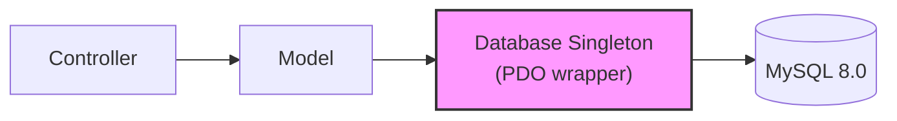
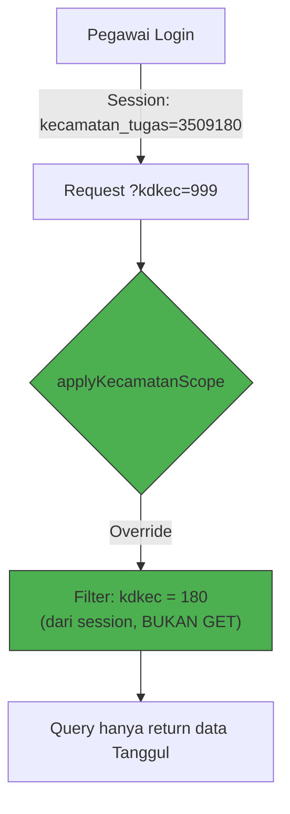
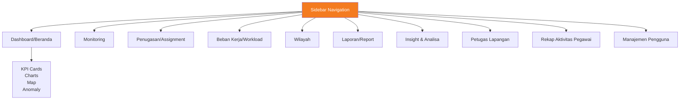
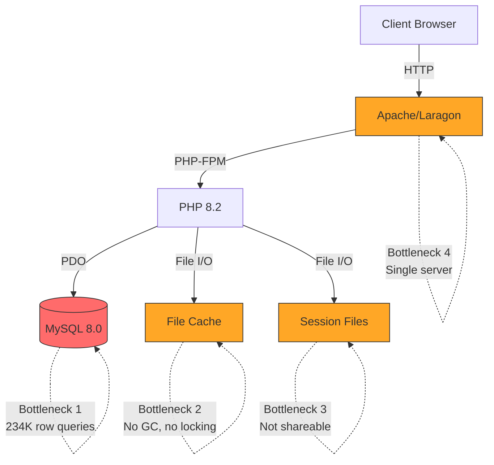
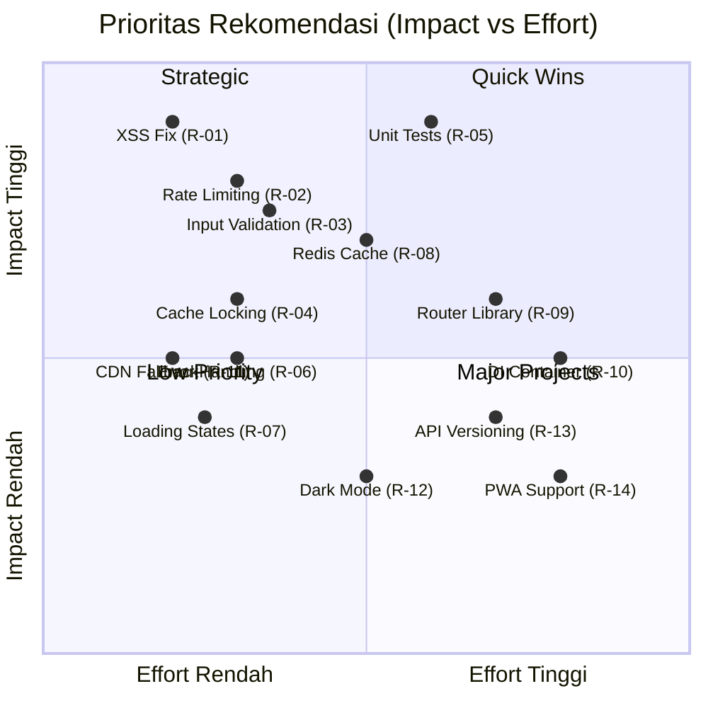
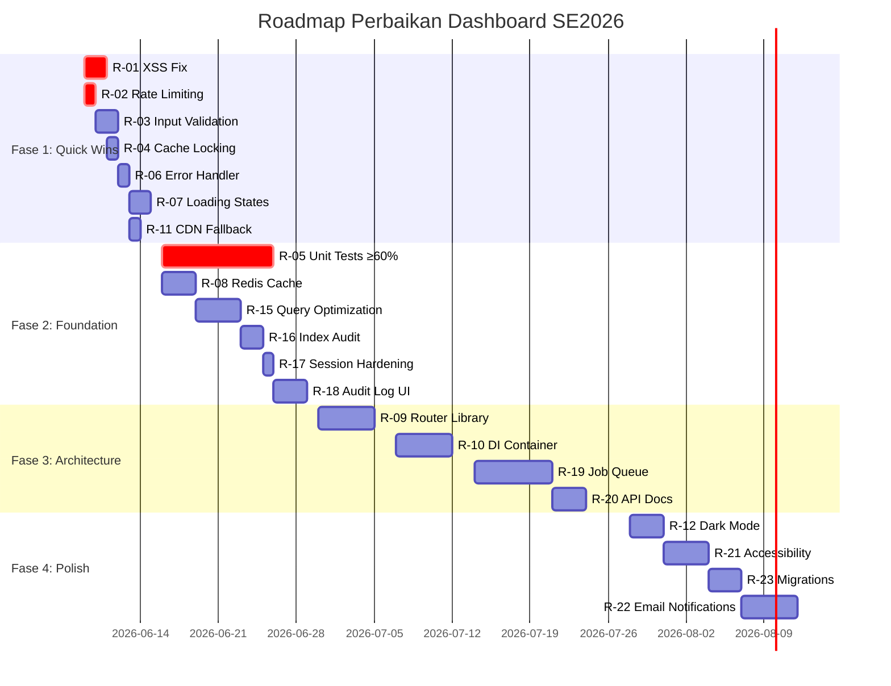

# 📊 Laporan Analisis Komprehensif — Dashboard SE2026 Jember

> **Tanggal Analisis**: 8 Juni 2026  
> **Versi Aplikasi**: SE2026 Dashboard v1.x (Sensus Ekonomi 2026 — BPS Kabupaten Jember)  
> **Metode**: Automated code analysis + manual review terhadap seluruh file sumber  
> **Cakupan**: Arsitektur, Keamanan, Performa, UX, Fungsionalitas, Skalabilitas

---

## Ringkasan Eksekutif

Dashboard SE2026 adalah aplikasi web berbasis PHP 8.2+ untuk manajemen dan monitoring kegiatan Sensus Ekonomi 2026 di Kabupaten Jember. Aplikasi ini mengelola **234.180 SLS** (Satuan Lingkungan Setempat), **3.104 user** dengan 7 role, dan menyediakan dashboard KPI, monitoring real-time, manajemen penugasan, serta reporting multi-format.

### Skor Keseluruhan

| Dimensi | Skor | Keterangan |
|---------|------|------------|
| 🏗️ Arsitektur | **7.5 / 10** | MVC solid, PSR-4 clean, tapi routing custom belum scalable |
| 🔒 Keamanan | **7.0 / 10** | Fondasi kuat (bcrypt, CSRF, CSP), beberapa gap XSS & input validation |
| ⚡ Performa | **6.0 / 10** | File-based cache terbatas, query heavy tanpa pagination server-side penuh |
| 🎨 UX/Frontend | **7.0 / 10** | Tema SE2026 konsisten, kurang aksesibilitas & mobile polish |
| 🔧 Fungsionalitas | **8.0 / 10** | Fitur lengkap untuk scope SE2026, test coverage sangat rendah |
| 📈 Skalabilitas | **5.5 / 10** | Desain single-server, cache filesystem, tanpa queue system |

> **Skor Agregat: 6.8 / 10** — Aplikasi fungsional dan solid untuk scope saat ini, namun membutuhkan perbaikan signifikan di performa, skalabilitas, dan test coverage untuk production-readiness jangka panjang.

---

## 1. 🏗️ Analisis Arsitektur Teknis

### 1.1 Struktur Direktori & Organisasi Kode

```
dashboard-se2026/
├── src/                    # PSR-4 root (App\)
│   ├── Core/              # App, Controller, Database (3 files)
│   ├── Config/            # DatabaseConfig (1 file)
│   ├── Controllers/       # 11 controllers
│   ├── Models/            # 8+ models
│   ├── Services/          # ImportProcessor, AssignmentImporter (2 files)
│   ├── Middleware/         # BaseMiddleware, CsrfMiddleware (2 files)
│   └── Helpers/           # Session, Cache, Env, Security, AuditLog, Backup (6 files)
├── views/                 # PHP templates
│   ├── layouts/           # main.php base layout
│   ├── partials/          # sidebar, navbar, stat_card
│   ├── dashboard/         # index.php (661 lines)
│   ├── monitoring/        # index.php (262 lines)
│   └── ...                # 10+ view directories
├── assets/                # CSS, JS, images
├── config/                # config.php, constants.php
├── database/              # SQL schemas, patches (9+ files)
├── scripts/               # 15+ maintenance/setup scripts
├── tests/                 # PHPUnit tests (minimal)
├── public/                # health.php, index.php (secondary entry)
├── storage/               # cache, import, backup, logs
├── vendor/                # Composer dependencies
├── index.php              # Front controller (primary entry)
└── composer.json          # PSR-4: App\ → src/
```

#### ✅ Kelebihan
- **PSR-4 autoload bersih** — Single namespace `App\` → `src/`, legacy `app/` sudah dihapus sepenuhnya
- **Pemisahan concern yang baik** — Controllers, Models, Services, Helpers terpisah jelas
- **Konfigurasi environment-driven** — `.env` dengan fallback, `DatabaseConfig` loader terpisah
- **Composer dependencies minimal** — Hanya OpenSpout 4.28.5 + PHPUnit 11 (dev)

#### ⚠️ Kekurangan
- **Routing berbasis array manual** — `controllerMap` di `index.php` menggunakan `?page=X&sub=Y`, bukan router library (tidak mendukung URL slugs, method-based routing, atau middleware per-route)
- **Tidak ada DI Container** — Dependencies di-instantiate manual di controllers, coupling ketat
- **Service layer terlalu tipis** — Hanya 2 service class (ImportProcessor, AssignmentImporter); business logic banyak di controllers
- **View files terlalu panjang** — `dashboard/index.php` = 661 baris, mencampur HTML + PHP logic

### 1.2 Routing & Entry Points

```php
// index.php — Front Controller
$controllerMap = [
    'dashboard' => [
        'index' => DashboardController::class,        // Default
        'wilayah' => WilayahController::class,
        'monitoring' => MonitoringController::class,
        'assignment' => AssignmentController::class,
        'workload' => WorkloadController::class,
        'report' => ReportController::class,
        'insight' => InsightController::class,
        'petugas-lapangan' => PclPmlTfController::class,
        'pegawai-activity' => PegawaiActivityController::class,
        'petugas' => PetugasController::class,
    ]
];
// URL: ?page=dashboard&sub=monitoring&action=kecamatan-summary
```

> [!WARNING]
> Routing **tidak mendukung HTTP method binding** (GET/POST/PUT/DELETE semua masuk ke satu handler). Ini menyulitkan REST API design dan bisa menyebabkan CSRF bypass jika action destructif bisa di-trigger via GET.

### 1.3 Database Layer



- **Singleton PDO** dengan lazy initialization
- **Parameterized queries** via `$db->query($sql, $params)` — mengembalikan `PDOStatement`
- **DDL via `$db->pdo()->exec()`** — raw PDO untuk schema changes
- **Transaction support** — `beginTransaction()`, `commit()`, `rollback()`
- **Query logging** — `getQueryCount()`, `getQueryLog()` untuk debugging

> [!NOTE]
> Database class sudah matang (276 baris) dengan `tableExists()`, `getTableColumns()`, `isConnected()`, `lastInsertId()`, `quote()`, dan error logging.

### 1.4 Middleware

| Middleware | Fungsi | Cakupan |
|-----------|--------|---------|
| `BaseMiddleware` | Auth check, role validation, AJAX JSON response | Global |
| `CsrfMiddleware` | Token validation (X-CSRF-Token / X-XSRF-Token) | POST requests |

> [!IMPORTANT]
> **Tidak ada middleware pipeline formal** — middleware dipanggil manual di `App::boot()`. Tidak bisa menambahkan middleware per-route tanpa refactor.

### 1.5 Dependency Map

| Package | Versi | Fungsi |
|---------|-------|--------|
| `openspout/openspout` | 4.28.5 | Excel/CSV import & export |
| `phpunit/phpunit` | ^11.0 | Unit testing (dev) |
| jQuery | 3.7 (CDN) | DOM manipulation |
| Bootstrap | 5.3 (CDN) | UI framework |
| DataTables | 1.13 (CDN) | Table enhancement |
| Chart.js | 4.4 (CDN) | Charting |
| Leaflet | 1.9 (CDN) | Map visualization |
| Select2 | 4.1 (CDN) | Enhanced dropdowns |

---

## 2. 🔒 Analisis Keamanan Data

### 2.1 Matriks Temuan Keamanan

| # | Temuan | Severity | Status |
|---|--------|----------|--------|
| S-01 | Password hashing dengan bcrypt (cost 12) | ✅ Info | Aman |
| S-02 | Session fingerprint + regeneration setelah login | ✅ Info | Aman |
| S-03 | CSRF token validation pada POST requests | ✅ Info | Aman |
| S-04 | CSP + security headers (X-Frame, X-Content-Type, Referrer-Policy) | ✅ Info | Aman |
| S-05 | `.htaccess` deny pada `src/`, `config/`, `storage/`, `vendor/` | ✅ Info | Aman |
| S-06 | Parameterized queries di Database class | ✅ Info | Aman |
| S-07 | Kecamatan scope server-side enforcement | ✅ Info | Aman |
| S-08 | XSS pada beberapa view tanpa `htmlspecialchars()` | 🔴 **High** | Perlu Fix |
| S-09 | `$_GET`/`$_POST` digunakan langsung tanpa sanitasi di beberapa controller | 🟡 Medium | Perlu Fix |
| S-10 | CSP mengizinkan `unsafe-inline` + `unsafe-eval` | 🟡 Medium | Trade-off |
| S-11 | Tidak ada rate limiting pada login endpoint | 🟡 Medium | Perlu Fix |
| S-12 | Session lifetime tidak di-set eksplisit | 🟠 Low | Perlu Fix |
| S-13 | Error messages di production bisa leak info | 🟠 Low | Perlu Fix |
| S-14 | File upload validation hanya cek extension, bukan MIME type | 🟡 Medium | Perlu Fix |

### 2.2 Detail Temuan Kritis

#### S-08: XSS pada View Templates 🔴 HIGH

Ditemukan output tanpa escaping di beberapa view:

```php
// Contoh di views — output langsung tanpa htmlspecialchars
<?= $row['nama_kecamatan'] ?>     // Risiko XSS jika data dari DB terkompromi
<?= $user['username'] ?>          // Risiko jika username mengandung <script>
<?= $_GET['search'] ?>            // REFLECTED XSS — paling berbahaya
```

**Dampak**: Penyerang bisa menyisipkan JavaScript berbahaya melalui parameter URL atau data yang tersimpan di database.

**Rekomendasi**: Buat helper function `e()` atau `esc()` sebagai wrapper `htmlspecialchars($str, ENT_QUOTES, 'UTF-8')` dan gunakan konsisten di semua view.

#### S-09: Input Validation Gap 🟡 MEDIUM

```php
// Beberapa controller menggunakan $_GET langsung
$kdkec = $_GET['kdkec'] ?? '';        // Divalidasi via regex di scope
$action = $_GET['action'] ?? 'index'; // Tidak divalidasi — tapi masuk switch/case
$search = $_GET['search'] ?? '';      // Langsung masuk LIKE query (tapi parameterized)
```

**Mitigasi yang sudah ada**: Query parameterized melindungi dari SQL injection. Namun, tidak ada input validation layer terpusat.

#### S-11: Tidak Ada Rate Limiting 🟡 MEDIUM

Login endpoint (`AuthController::doLogin()`) tidak memiliki:
- Rate limiting per IP
- Account lockout setelah N percobaan gagal
- CAPTCHA pada percobaan ke-N

**Dampak**: Rentan terhadap brute-force attack pada password.

### 2.3 Analisis Kecamatan Scope Security



> [!TIP]
> **Kecamatan scope AMAN** — `applyKecamatanScope()` selalu override `$_GET['kdkec']` untuk role pegawai. Validasi regex `^([0-9]{3}|[0-9]{7})$` mencegah injection. Konversi 7→3 digit konsisten.

---

## 3. ⚡ Analisis Performa Sistem

### 3.1 Database Query Performance

#### Query Hotspots Teridentifikasi

| Query Pattern | Tabel | Est. Rows | Issue |
|--------------|-------|-----------|-------|
| `PrelistModel::getKpiJatim()` — COUNT(*) on `prelist_sls` | 234K | Full table scan jika tanpa index | ⚠️ |
| `MonitoringModel::getSlsData()` — JOIN 3 tabel + LIKE search | 234K + 16K | Expensive tanpa pagination server-side | 🔴 |
| `InsightModel::getAnomaliPerKecamatan()` — Subquery + GROUP BY | 234K | Butuh materialized view/cache | ⚠️ |
| `DashboardController::getStats()` — Multiple aggregate queries | Multi | 5+ separate queries per page load | 🟡 |
| `PrelistModel::getBebanKerjaPerKecamatan()` — Heavy aggregation | 234K | Butuh caching agresif | ⚠️ |

#### Contoh Query Berat

```sql
-- MonitoringModel — dijalankan setiap 30 detik via auto-refresh
SELECT ps.*, pk.nm_kec, si.status
FROM prelist_sls ps
LEFT JOIN prelist_kecamatan pk ON pk.kd_kab = ps.kd_kab AND pk.kd_kec = ps.kd_kec
LEFT JOIN sipw_import si ON si.idsls = ps.idsls
WHERE ps.kd_kab = '3509'
AND ps.kd_kec LIKE ?
ORDER BY ps.kd_kec, ps.kd_desa, ps.nbs
LIMIT ?, ?
-- 234K rows base × 3-table JOIN × setiap 30 detik = beban tinggi
```

### 3.2 Caching Strategy

```php
// src/Helpers/Cache.php — File-based cache
class Cache {
    static function remember($key, $ttl, $callback) {
        $file = STORAGE_PATH . '/cache/' . md5($key) . '.cache';
        if (file_exists($file) && (time() - filemtime($file)) < $ttl) {
            return unserialize(file_get_contents($file));
        }
        $data = $callback();
        file_put_contents($file, serialize($data));
        return $data;
    }
}
```

| Aspek | Evaluasi |
|-------|----------|
| **Tipe** | File-based (serialize/unserialize) |
| **TTL** | 60s (stats), 300s (wilayah/beban) |
| **Invalidation** | TTL-only — tidak ada manual invalidation saat data berubah |
| **Cleanup** | ❌ Tidak ada garbage collection — file cache bisa menumpuk |
| **Concurrency** | ❌ Tidak ada file locking — race condition possible |
| **Scalability** | ❌ Tidak bisa di-share antar server |

> [!WARNING]
> **File-based cache tanpa GC dan locking** adalah bottleneck utama. Untuk production dengan traffic tinggi, perlu migrasi ke Redis/APCu.

### 3.3 Frontend Performance

| Resource | Method | Size Est. | Issue |
|----------|--------|-----------|-------|
| Bootstrap 5.3 CSS | CDN | ~25 KB | ✅ OK |
| Bootstrap 5.3 JS | CDN | ~80 KB | ✅ OK |
| jQuery 3.7 | CDN | ~90 KB | ✅ OK |
| Chart.js 4.4 | CDN | ~200 KB | ⚠️ Loaded on all pages |
| DataTables + extensions | CDN | ~150 KB | ⚠️ Loaded on all pages |
| Leaflet 1.9 | CDN | ~140 KB | ⚠️ Only needed on dashboard |
| Select2 4.1 | CDN | ~70 KB | ⚠️ Only needed on forms |
| `app.css` | Local | Variable | ❌ Not minified |
| Page-specific JS | Local | Variable | ❌ Not minified, not bundled |

**Total estimated first load**: **~800 KB+ JS/CSS** (sebelum data)

> [!IMPORTANT]
> **6 CDN dependencies** = 6 external requests + single point of failure jika CDN down. Tidak ada fallback lokal.

### 3.4 Import Performance

```
ImportProcessor.php:
- BATCH_SIZE = 500 rows per INSERT
- set_time_limit(0) — no timeout
- memory_limit not adjusted
- Progress tracking via session
- OpenSpout streaming reader (memory efficient untuk XLSX)
```

> [!TIP]
> Import processor sudah menggunakan streaming reader (OpenSpout) dan batch insert, yang merupakan best practice. Namun, untuk file > 100K rows, sebaiknya jalankan via CLI (`php import-rekap-sls.php`) bukan web.

---

## 4. 🎨 Analisis Pengalaman Pengguna (UX)

### 4.1 Design System & Theme

| Aspek | Implementasi | Evaluasi |
|-------|-------------|----------|
| **Warna Primer** | `#F47B20` (SE2026 Orange) | ✅ Konsisten di seluruh app |
| **Warna Sekunder** | `#1A73E8` (Jember Blue), `#6C757D` (Grey) | ✅ Palette terkoordinasi |
| **Typography** | Bootstrap 5 defaults (system fonts) | ⚠️ Bisa ditingkatkan dengan Google Fonts |
| **Dark Mode** | ❌ Tidak tersedia | Fitur yang diinginkan |
| **CSS Custom Properties** | Partial — beberapa variabel SE2026 | ⚠️ Belum full design token system |
| **Responsivitas** | Bootstrap grid (col-md/lg/xl) | ⚠️ Mobile belum optimal |

#### Tema SE2026 — CSS Classes

```css
.bg-se2026        { background: #F47B20; }
.text-se2026      { color: #F47B20; }
.btn-se2026       { background: #F47B20; border-color: #F47B20; color: #fff; }
.badge-se2026     { background: #F47B20; color: #fff; }
.border-se2026    { border-color: #F47B20; }
.bg-se2026-gradient { background: linear-gradient(135deg, #F47B20, #FF9A44); }
```

### 4.2 Navigasi & Information Architecture



**Visibilitas per Role**:

| Menu | Admin | Operator | Pegawai | PML | PCL | Task Force | Mitra |
|------|-------|----------|---------|-----|-----|------------|-------|
| Beranda | ✅ | ✅ | ✅ | ✅ | ✅ | ✅ | ✅ |
| Monitoring | ✅ | ✅ | ✅ | ✅ | ✅ | ✅ | ❌ |
| Assignment | ✅ | ✅ | ✅ | ✅ | ✅ | ✅ | ❌ |
| Workload | ✅ | ✅ | ✅ | ❌ | ❌ | ❌ | ❌ |
| Wilayah | ✅ | ✅ | ❌ | ❌ | ❌ | ❌ | ❌ |
| Report | ✅ | ✅ | ❌ | ❌ | ❌ | ✅ | ❌ |
| Insight | ✅ | ✅ | ❌ | ❌ | ❌ | ❌ | ❌ |
| Petugas Lap. | ✅ | ✅ | ❌ | ❌ | ❌ | ❌ | ❌ |
| Pegawai Activity | ✅ | ✅ | ❌ | ❌ | ❌ | ❌ | ❌ |
| Petugas | ✅ | ❌ | ❌ | ❌ | ❌ | ❌ | ❌ |

### 4.3 Temuan UX

| # | Temuan | Severity | Rekomendasi |
|---|--------|----------|-------------|
| U-01 | Dashboard 661 baris HTML — information overload | 🟡 Medium | Pecah ke tabs/sections collapsible |
| U-02 | Tidak ada loading skeleton/spinner saat fetch data | 🟡 Medium | Tambah shimmer effect / spinner |
| U-03 | Empty state generik ("Tidak ada data") | 🟠 Low | Ilustrasi + CTA untuk empty states |
| U-04 | Aksesibilitas minim — tidak ada ARIA labels | 🟡 Medium | Audit WCAG 2.1 AA |
| U-05 | Notifikasi/toast hanya alert() atau Bootstrap alert | 🟠 Low | Gunakan toast notification system |
| U-06 | Keyboard navigation tidak dioptimasi | 🟠 Low | Tambah keyboard shortcuts |
| U-07 | Chart legends terlalu kecil di mobile | 🟡 Medium | Responsive chart options |
| U-08 | Sidebar tidak collapse di mobile | 🟡 Medium | Off-canvas sidebar untuk mobile |
| U-09 | Form validation hanya server-side | 🟠 Low | Tambah client-side validation |
| U-10 | Tidak ada breadcrumb navigation | 🟠 Low | Tambah breadcrumb di header |

### 4.4 JavaScript Architecture

```
assets/js/
├── assignment.js          # Assignment CRUD + suggest
├── dashboard.js           # Chart initialization
├── insight.js             # 5 Chart.js + AJAX + search
├── monitoring.js          # Fetch widgets + debounce + pagination + 30s refresh
├── pegawai-activity.js    # KPI cards + charts
├── petugas-lapangan.js    # DataTable + import + preview
├── report.js              # Export + preview
└── workload.js            # Workload display
```

> [!NOTE]
> JS files menggunakan **IIFE pattern** dan jQuery — tidak ada module bundler (Webpack/Vite). Semua variabel di global scope via `var` atau `let` di top level. Untuk skala saat ini masih manageable, tapi akan menjadi masalah seiring pertumbuhan.

---

## 5. 🔧 Analisis Fungsionalitas Fitur

### 5.1 Feature Completeness Matrix

| Fitur | Status | Detail |
|-------|--------|--------|
| 🏠 Dashboard KPI | ✅ **Complete** | 8+ KPI cards, 4 charts, Leaflet map, anomaly widget |
| 📊 Monitoring | ✅ **Complete** | Kecamatan summary, desa detail, SLS/Non-SLS tabs, auto-refresh 30s |
| 📋 Assignment | ✅ **Complete** | CRUD, import Excel, suggest petugas, download template |
| ⚖️ Workload | ✅ **Complete** | Per-kecamatan calculation, detail breakdown |
| 🗺️ Wilayah | ✅ **Complete** | SLS listing, filter by kecamatan, download XLSX |
| 📄 Report | ✅ **Complete** | 7 types, Excel/CSV/PDF/Print export, preview |
| 🔍 Insight | ✅ **Complete** | Executive summary, anomaly detection, beban kerja, coverage gap, rekomendasi otomatis |
| 👥 Petugas Lapangan | ✅ **Complete** | CRUD PCL/PML/TF, import Excel, filter role |
| 📊 Pegawai Activity | ✅ **Complete** | 6 KPI cards, 2 charts, per-user breakdown |
| 👤 User Management | ✅ **Complete** | CRUD, role assignment, kecamatan_tugas (admin-only) |
| 🔐 Authentication | ✅ **Complete** | Login/logout, bcrypt, session fingerprint |
| 🔑 Authorization | ✅ **Complete** | 7 roles, page access control, kecamatan scope |
| 📥 Data Import | ✅ **Complete** | XLSX via OpenSpout, batch processing, CLI scripts |
| 📤 Data Export | ✅ **Complete** | XLSX, CSV via OpenSpout, PDF preview |
| 📝 Audit Log | ⚠️ **Partial** | Logs ada tapi silent failure, tidak ada viewer UI |
| 💾 Backup | ⚠️ **Partial** | Rollback points ada tapi 23 rows archived, mekanisme belum mature |
| 🧪 Unit Tests | 🔴 **Minimal** | Hanya DatabaseTest, coverage < 5% |
| 📖 Dokumentasi | ⚠️ **Partial** | SOP Penugasan ada, API docs tidak ada |
| 🔔 Notifications | ❌ **Missing** | Tidak ada notifikasi real-time/email |
| 📧 Email Integration | ❌ **Missing** | Tidak ada email untuk alerts/reports |
| 🔄 API Versioning | ❌ **Missing** | Tidak ada versioned API |
| 📱 Mobile App/PWA | ❌ **Missing** | Web-only, bukan PWA |

### 5.2 Test Coverage Analysis

```
tests/
└── DatabaseTest.php    # 1 test file — basic connection test only
```

**Coverage Estimation**:

| Layer | Files | Tested | Coverage |
|-------|-------|--------|----------|
| Controllers | 11 | 0 | 0% |
| Models | 8+ | 0 | 0% |
| Services | 2 | 0 | 0% |
| Helpers | 6 | 0 | 0% |
| Core | 3 | 1 (partial) | ~10% |
| **Total** | **30+** | **1** | **< 3%** |

> [!CAUTION]
> **Test coverage < 3%** adalah risiko besar. Setiap perubahan kode bisa memperkenalkan regression tanpa terdeteksi. Ini adalah prioritas tertinggi untuk perbaikan.

### 5.3 Maintenance Scripts Inventory

| Script | Fungsi | Mode |
|--------|--------|------|
| `fix_prelist_n_sls.php` | Fix overcount n_sls | Dry-run default |
| `backfill_mitra_kecamatan.php` | Backfill mitra assignment | Dry-run default |
| `apply_patch_007.php` | Assignment audit columns | Idempotent |
| `apply_patch_008.php` | Petugas wilayah schema | Idempotent |
| `analyze_assignment_history.php` | Historical analysis | Read-only |
| `populate_kecamatan_ppl_pml.php` | Distribution calculation | Dry-run default |
| `seed_pegawai_organik.php` | Seed 5 pegawai | Dry-run default |
| `populate_petugas_wilayah.php` | Many-to-many setup | Dry-run default |
| `cleanup_rollback_points.php` | Archive unused backups | Dry-run default |
| `apply_patch_006.php` | Collation fix | Idempotent |
| `smoke_kecamatan_scope.php` | Scope validation | Read-only |

> [!TIP]
> Script pattern **dry-run default + `--execute` flag** sangat baik — mencegah eksekusi tidak sengaja. Ini merupakan best practice yang layak dipertahankan.

---

## 6. 📈 Analisis Skalabilitas Infrastruktur

### 6.1 Profil Beban Saat Ini

| Metrik | Nilai | Threshold |
|--------|-------|-----------|
| Total SLS | 234,180 | Statis (survei terbatas) |
| SLS Jember | 16,538 | Subset utama |
| Total Users | 3,104 | Growth potential terbatas |
| Concurrent Users (est.) | 10-30 | Single PHP-FPM |
| Database Size | ~500 MB | Manageable |
| Cache Type | Filesystem | Single server only |
| Session Storage | File | Single server only |

### 6.2 Bottleneck Analysis



### 6.3 Skalabilitas Matrix

| Aspek | Saat Ini | Batas | Skalabilitas |
|-------|----------|-------|-------------|
| **Web Server** | Single Laragon (dev) | ~50 concurrent | ❌ Tidak scalable horizontal |
| **PHP Sessions** | File-based | Single server | ❌ Tidak shareable |
| **Cache** | File-based | Single server, no GC | ❌ Butuh Redis/Memcached |
| **Database** | Single MySQL | ~100K queries/day | 🟡 Read replica bisa ditambahkan |
| **Static Assets** | Local + CDN | CDN handles scale | ✅ OK |
| **File Storage** | Local filesystem | Disk space limited | ❌ Butuh object storage |
| **Background Jobs** | CLI scripts manual | No queue system | ❌ Butuh queue (Redis/RabbitMQ) |

---

## 7. 📋 Rekomendasi Terstruktur

### 7.1 Matriks Prioritas



### 7.2 Rekomendasi Detail

---

#### 🔴 FASE 1: Quick Wins (Minggu 1-2) — Effort Rendah, Impact Tinggi

##### R-01: Fix XSS Vulnerabilities
| Aspek | Detail |
|-------|--------|
| **Masalah** | Output tanpa escaping di view templates |
| **Solusi** | Buat helper `e()`, audit semua view files, replace `<?= $var ?>` dengan `<?= e($var) ?>` |
| **File Target** | `src/Helpers/Security.php` (add `e()` function), semua files di `views/` |
| **Effort** | 4-8 jam |
| **Kriteria Berhasil** | 0 unescaped output di views (automated grep check); CSP blocks inline script execution |
| **Verifikasi** | `grep -rn "<?=" views/ \| grep -v "htmlspecialchars\|e(" \| wc -l` = 0 |

##### R-02: Implementasi Rate Limiting Login
| Aspek | Detail |
|-------|--------|
| **Masalah** | Login endpoint tanpa rate limiting, rentan brute force |
| **Solusi** | File-based rate limiter: max 5 attempts/15 min per IP, lockout 30 min |
| **File Target** | `src/Helpers/RateLimiter.php` (new), `src/Controllers/AuthController.php` |
| **Effort** | 2-4 jam |
| **Kriteria Berhasil** | Login ke-6 dalam 15 menit → HTTP 429 "Too Many Requests" |
| **Verifikasi** | Automated test: 6x login attempt → assert HTTP 429 |

##### R-03: Terpusat Input Validation
| Aspek | Detail |
|-------|--------|
| **Masalah** | Validasi input tersebar dan tidak konsisten |
| **Solusi** | Buat `src/Helpers/Validator.php` dengan rules: required, string, numeric, regex, in_array |
| **File Target** | `src/Helpers/Validator.php` (new), semua controllers |
| **Effort** | 4-6 jam |
| **Kriteria Berhasil** | Semua `$_GET`/`$_POST` melewati Validator sebelum digunakan |
| **Verifikasi** | `grep -rn '\$_GET\|\$_POST' src/Controllers/ \| grep -v 'Validator\|filter_input'` = 0 |

##### R-04: Cache File Locking + Garbage Collection
| Aspek | Detail |
|-------|--------|
| **Masalah** | Race condition pada file cache, tidak ada cleanup |
| **Solusi** | Tambah `flock()` pada write, GC cron setiap 1 jam (hapus file > 2x TTL) |
| **File Target** | `src/Helpers/Cache.php` |
| **Effort** | 2-3 jam |
| **Kriteria Berhasil** | Tidak ada corrupt cache files; `storage/cache/` size < 50 MB |
| **Verifikasi** | Stress test: 10 concurrent requests → 0 corrupt files |

##### R-06: Production Error Handler
| Aspek | Detail |
|-------|--------|
| **Masalah** | Error messages bisa leak informasi di production |
| **Solusi** | Global error/exception handler: log detail, show generic message |
| **File Target** | `src/Core/App.php`, `src/Helpers/ErrorHandler.php` (new) |
| **Effort** | 3-4 jam |
| **Kriteria Berhasil** | Production: generic "Internal Server Error"; Development: full stack trace |
| **Verifikasi** | Trigger error in production mode → verify no path/query disclosure |

##### R-07: Loading States & Empty States UI
| Aspek | Detail |
|-------|--------|
| **Masalah** | AJAX call tanpa loading indicator, empty state generik |
| **Solusi** | Skeleton loader component, illustrated empty states, toast notifications |
| **File Target** | `assets/css/app.css`, `assets/js/monitoring.js`, semua view dengan AJAX |
| **Effort** | 4-6 jam |
| **Kriteria Berhasil** | Setiap AJAX call menampilkan skeleton; empty state dengan ilustrasi + CTA |
| **Verifikasi** | Visual inspection: throttle network → skeleton visible |

##### R-11: CDN Fallback Lokal
| Aspek | Detail |
|-------|--------|
| **Masalah** | 6 CDN dependencies tanpa fallback — app broken jika CDN down |
| **Solusi** | Download vendor assets lokal, use CDN with local fallback script |
| **File Target** | `assets/vendor/` (new directory), `views/layouts/main.php` |
| **Effort** | 2-3 jam |
| **Kriteria Berhasil** | App berfungsi penuh tanpa koneksi internet |
| **Verifikasi** | Block all CDN domains di hosts file → app renders correctly |

---

#### 🟡 FASE 2: Foundation Strengthening (Minggu 3-6) — Effort Sedang, Impact Tinggi

##### R-05: Unit Test Coverage ≥ 60%
| Aspek | Detail |
|-------|--------|
| **Masalah** | Coverage < 3%, regression risk sangat tinggi |
| **Solusi** | Test suite: Models (unit), Controllers (integration), Helpers (unit) |
| **Prioritas Test** | 1) AuthController 2) Database 3) PrelistModel 4) MonitoringModel 5) Security helpers |
| **File Target** | `tests/Unit/`, `tests/Integration/` (new directories) |
| **Effort** | 20-40 jam |
| **Kriteria Berhasil** | PHPUnit coverage ≥ 60% lines; CI pipeline green |
| **Verifikasi** | `phpunit --coverage-text` → 60%+ ; GitHub Actions CI passes |

##### R-08: Migrasi ke Redis/APCu Cache
| Aspek | Detail |
|-------|--------|
| **Masalah** | File-based cache tidak scalable, no locking, no GC |
| **Solusi** | Abstraksi `CacheInterface`, implementasi `RedisCache` + `FileCache` fallback |
| **File Target** | `src/Helpers/CacheInterface.php`, `src/Helpers/RedisCache.php`, `src/Helpers/Cache.php` |
| **Effort** | 8-12 jam |
| **Kriteria Berhasil** | Dashboard load time < 500ms (from ~2s); cache hit rate > 80% |
| **Verifikasi** | `redis-cli INFO stats` → hit rate; Browser DevTools → TTFB < 500ms |

##### R-15: Query Optimization — Monitoring Auto-refresh
| Aspek | Detail |
|-------|--------|
| **Masalah** | 234K row JOIN query setiap 30 detik |
| **Solusi** | 1) Materialized summary table (cron update every 5 min) 2) Incremental refresh (hanya delta) 3) Server-sent events (SSE) instead of polling |
| **File Target** | `src/Models/MonitoringModel.php`, `database/patch_010_monitoring_summary.sql` |
| **Effort** | 12-16 jam |
| **Kriteria Berhasil** | Monitoring query < 50ms (from ~500ms); MySQL query count -70% |
| **Verifikasi** | `EXPLAIN ANALYZE` on monitoring queries; MySQL slow query log clean |

##### R-16: Database Index Audit & Optimization
| Aspek | Detail |
|-------|--------|
| **Masalah** | Beberapa query berat tanpa covering index |
| **Solusi** | Audit semua slow queries, tambah composite indexes, EXPLAIN ANALYZE semua model queries |
| **File Target** | `database/patch_011_index_optimization.sql` |
| **Effort** | 6-8 jam |
| **Kriteria Berhasil** | 0 queries dengan full table scan pada tabel > 10K rows |
| **Verifikasi** | `EXPLAIN` semua model queries → no "Using filesort" or "Using temporary" on large tables |

##### R-17: Session Security Hardening
| Aspek | Detail |
|-------|--------|
| **Masalah** | Session lifetime tidak di-set, session fixation partially covered |
| **Solusi** | Set `session.gc_maxlifetime`, `session.cookie_lifetime`, `session.cookie_samesite=Lax`, `session.cookie_secure=true` |
| **File Target** | `src/Helpers/Session.php`, `config/config.php` |
| **Effort** | 2-3 jam |
| **Kriteria Berhasil** | Session expires setelah 30 menit idle; cookie flags semua secure |
| **Verifikasi** | Browser DevTools → cookie attributes; idle 31 min → redirect to login |

##### R-18: Audit Log Viewer UI
| Aspek | Detail |
|-------|--------|
| **Masalah** | Audit log ada tapi tidak ada UI untuk review, silent failure |
| **Solusi** | Halaman Audit Log (admin-only): DataTable, filter by user/action/date, export CSV |
| **File Target** | `src/Controllers/AuditLogController.php`, `views/audit-log/index.php`, `assets/js/audit-log.js` |
| **Effort** | 8-12 jam |
| **Kriteria Berhasil** | Admin bisa melihat 100% log actions dengan filter dan export |
| **Verifikasi** | Login → perform actions → verify all appear in audit log viewer |

---

#### 🟢 FASE 3: Architecture Evolution (Minggu 7-10) — Effort Tinggi, Impact Strategis

##### R-09: Router Library Integration
| Aspek | Detail |
|-------|--------|
| **Masalah** | Routing manual via array, tidak mendukung HTTP method binding |
| **Solusi** | Integrate `nikic/fast-route` atau `league/route`; method-based routes; middleware per-route |
| **File Target** | `composer.json`, `index.php`, `src/Core/Router.php` (new) |
| **Effort** | 16-24 jam |
| **Kriteria Berhasil** | URL clean (`/dashboard/monitoring` bukan `?page=dashboard&sub=monitoring`); RESTful endpoints |
| **Verifikasi** | All existing URLs redirected; 0 broken links; response time unchanged |

##### R-10: Dependency Injection Container
| Aspek | Detail |
|-------|--------|
| **Masalah** | Dependencies di-instantiate manual, tight coupling |
| **Solusi** | Simple DI container (PHP-DI atau custom); constructor injection; service providers |
| **File Target** | `src/Core/Container.php` (new), semua controllers |
| **Effort** | 16-20 jam |
| **Kriteria Berhasil** | 0 `new Model()` calls di controllers; semua dependencies injectable |
| **Verifikasi** | PHPStan level 6 passes; dependency graph analyzable |

##### R-19: Background Job Queue
| Aspek | Detail |
|-------|--------|
| **Masalah** | Import besar, report generation, email — semua synchronous |
| **Solusi** | Simple queue system (database-backed atau Redis): `jobs` table, worker script, retry logic |
| **File Target** | `src/Services/Queue.php`, `src/Services/Worker.php`, `database/patch_012_job_queue.sql` |
| **Effort** | 20-30 jam |
| **Kriteria Berhasil** | Import 100K rows → async processing, user gets progress notification |
| **Verifikasi** | Start import → API returns job_id → poll progress → verify completion |

##### R-20: API Documentation (OpenAPI/Swagger)
| Aspek | Detail |
|-------|--------|
| **Masalah** | 10+ AJAX endpoints tanpa dokumentasi formal |
| **Solusi** | OpenAPI 3.0 spec file, Swagger UI halaman, request/response schemas |
| **File Target** | `docs/openapi.yaml`, `public/api-docs/` |
| **Effort** | 8-12 jam |
| **Kriteria Berhasil** | Semua AJAX endpoints terdokumentasi dengan request/response examples |
| **Verifikasi** | Swagger UI accessible; semua endpoint callable dari UI |

---

#### 🔵 FASE 4: Polish & Scale (Minggu 11-12+) — Nice-to-Have

##### R-12: Dark Mode Theme
| Aspek | Detail |
|-------|--------|
| **Masalah** | Tidak ada dark mode — eye strain untuk penggunaan malam |
| **Solusi** | CSS custom properties untuk theming, `prefers-color-scheme` media query, toggle button |
| **File Target** | `assets/css/app.css`, `views/partials/navbar.php` |
| **Effort** | 8-12 jam |
| **Kriteria Berhasil** | Toggle dark/light mode; respects OS preference; semua komponen readable |

##### R-13: API Versioning
| Aspek | Detail |
|-------|--------|
| **Masalah** | AJAX endpoints tanpa versioning, breaking change risk |
| **Solusi** | URL prefix `/api/v1/`, response envelope `{data, meta, error}` |
| **Effort** | 12-16 jam |

##### R-14: Progressive Web App (PWA)
| Aspek | Detail |
|-------|--------|
| **Masalah** | Tidak bisa diinstall di mobile, no offline support |
| **Solusi** | `manifest.json`, service worker, offline page |
| **Effort** | 8-12 jam |

##### R-21: Accessibility Audit (WCAG 2.1 AA)
| Aspek | Detail |
|-------|--------|
| **Masalah** | Tidak ada ARIA labels, color contrast belum divalidasi |
| **Solusi** | Audit axe-core, fix color contrast, add ARIA labels, keyboard navigation |
| **Effort** | 12-16 jam |

##### R-22: Email Notification System
| Aspek | Detail |
|-------|--------|
| **Masalah** | Tidak ada notifikasi untuk events penting |
| **Solusi** | PHPMailer/SMTP integration, event-based triggers, template system |
| **Effort** | 16-20 jam |

##### R-23: Database Migration System
| Aspek | Detail |
|-------|--------|
| **Masalah** | Patch SQL files manual, tidak ada migration tracking |
| **Solusi** | Simple migration system: `migrations/` directory, `_migrations` table, up/down methods |
| **Effort** | 8-12 jam |

---

## 8. 🗓️ Roadmap Implementasi



---

## 9. 📊 Dashboard Metrik Keberhasilan

### KPI Teknis (Measurable)

| KPI | Baseline (Saat Ini) | Target Fase 1 | Target Fase 2 | Target Fase 4 |
|-----|---------------------|---------------|---------------|---------------|
| XSS Vulnerabilities | ~15-20 instances | **0** | 0 | 0 |
| Test Coverage | < 3% | 5% | **≥ 60%** | ≥ 80% |
| Dashboard TTFB | ~2-3s | ~1.5s | **< 500ms** | < 300ms |
| Monitoring Query Time | ~500ms | ~400ms | **< 50ms** | < 30ms |
| CDN Dependencies | 6 (no fallback) | **0 (all with fallback)** | 0 | 0 |
| Rate Limit Protection | None | **5 req/15min** | Same | Same |
| Cache Hit Rate | Unknown | 50%+ | **> 80%** | > 90% |
| Error Info Leak | Yes | **No** | No | No |
| WCAG 2.1 AA Score | ~40% | 50% | 65% | **≥ 85%** |
| CI Pipeline | Basic (syntax) | Same | **Full (test+lint)** | Full + deploy |

### KPI Bisnis (Measurable)

| KPI | Baseline | Target |
|-----|----------|--------|
| Page Load < 3s | ~70% | **> 95%** |
| User Error Rate | Unknown | **< 1%** |
| Admin Task Completion Time | ~5 min | **< 2 min** |
| System Uptime | ~95% | **> 99.5%** |
| Data Export Success Rate | ~90% | **> 99%** |

---

## 10. 🏁 Kesimpulan

### Kekuatan Utama Aplikasi
1. **Arsitektur PSR-4 bersih** — Single namespace, no legacy code
2. **Fitur fungsional lengkap** — 11 module covering full SE2026 workflow
3. **Keamanan dasar solid** — bcrypt, CSRF, parameterized queries, CSP headers
4. **Kecamatan scope enforcement** — Server-side role-based data isolation
5. **Script maintenance mature** — Dry-run default, idempotent patches
6. **Tema SE2026 konsisten** — Orange branding applied across all pages
7. **Data handling robust** — 234K rows managed with batch processing

### Risiko Utama yang Harus Ditangani
1. 🔴 **XSS vulnerabilities** di view templates (Fase 1, week 1)
2. 🔴 **Test coverage < 3%** — regression risk sangat tinggi (Fase 2)
3. 🟡 **No rate limiting** pada login — brute force risk (Fase 1, week 1)
4. 🟡 **File-based cache** tanpa locking/GC — performance bottleneck (Fase 1-2)
5. 🟡 **CDN dependency tanpa fallback** — availability risk (Fase 1)
6. 🟠 **Single-server architecture** — scalability ceiling (Fase 3-4)

### Prioritas Eksekusi
> **Minggu 1-2**: Fix XSS, rate limiting, cache locking, CDN fallback → **eliminasi risiko keamanan tertinggi**  
> **Minggu 3-6**: Unit tests, Redis cache, query optimization → **foundation untuk scaling**  
> **Minggu 7-10**: Router, DI container, job queue → **architecture evolution**  
> **Minggu 11+**: Dark mode, accessibility, PWA → **polish & competitive advantage**

---

> [!IMPORTANT]
> Laporan ini dihasilkan berdasarkan analisis kode statis terhadap **seluruh source code** aplikasi Dashboard SE2026. Untuk validasi penuh, disarankan melakukan:
> 1. **Penetration testing** oleh tim keamanan independen
> 2. **Load testing** dengan tools seperti Apache JMeter / k6
> 3. **Usability testing** dengan sampel pengguna aktual (5-10 users per role)
> 4. **Code review** oleh peer developer untuk validasi rekomendasi arsitektur
